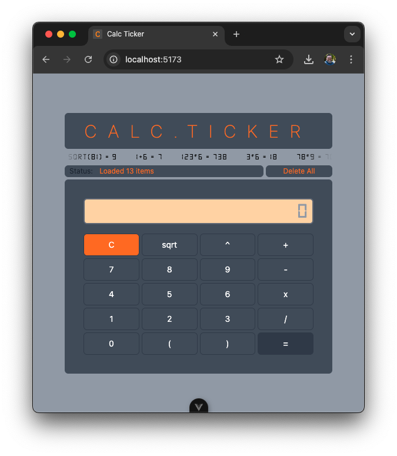

## CALC TICKER SETUP STEPS

1. Setup Backend

- cd backend
- composer install
- cp .env.example .env
- add to .env:
  - DB_CONNECTION=sqlite
  - DB_DATABASE=database/database.sqlite
- php artisan key:generate
- touch database/database.sqlite
- php artisan migrate
- php artisan serve --port=3500
- #backend runs on localhost:3500

2. Setup Frontend

- cd frontend
- npm install && npm run dev
- #frontend runs on localhost:5173

3. Tests

- cd backend
- php artisan test
- cd frontend
- npm run test:unit
